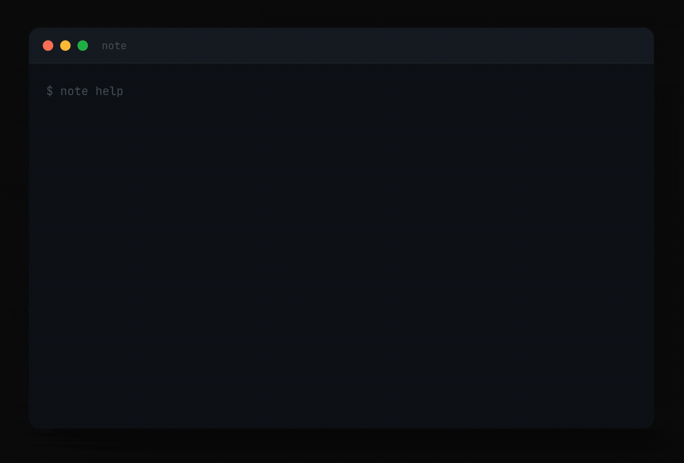

# note

A minimal knowledge base for your terminal. Store anything, search everything, find it in seconds. No cloud, no account, just your notes on your machine.

<p align="center">
  
</p>

## Installation

```
git clone https://github.com/butwhoistrace/note.git
cd note
go build -ldflags="-s -w" -o note .
sudo mv note /usr/local/bin/
```

## Performance

```
Binary:   2.4 MB
Search:   ~20ms
Startup:  ~15ms
RAM:      < 10MB
```

## Commands

### Core
```
note new "Name" [--tag t1 t2]          Create a note
note add "Name" "text"                 Append a line
note quick "text" [--tag t]            Quick one-liner
note show "Name"                       Display a note
note edit "Name" <line> "text"         Replace a line
note rm "Name" <line>                  Remove a line
note delete "Name"                     Move to trash
note restore "Name"                    Restore from trash
note rename "Old" "New"                Rename a note
```

### Search
```
note search "query"                    Full-text search
note search "query" --tag t            Filter by tag
note search "admni" --fuzzy            Typo-tolerant (Levenshtein)
note search "\d+\.\d+" --regex         Regex pattern search
note search "query" --context 3        Show surrounding lines
```

### Organize
```
note list [--tag t] [--sort name]      List notes
note tags                              Show all tags
note tag "Name" t1 t2                  Add tags
note untag "Name" t1                   Remove a tag
note tree                              Tree view grouped by tags
```

### Security
```
note encrypt "Name"                    Encrypt a note (AES-256-GCM)
note decrypt "Name"                    Decrypt a note
note lock                              Encrypt all notes + index
note unlock                            Decrypt everything
```

### Hooks
```
note hook <event> <command>            Add a hook
```
Events: new, add, delete, sync, search

### Sync
```
note init                              Init git repo
note sync                              Git push
note pull                              Git pull
```

### Export/Import
```
note export "Name" --format md         Export note
note export --all --format zip         Export all
note import file.md [--to "Name"]      Import file
```

### Maintenance
```
note reindex                           Rebuild search index
note trash [--clear]                   View/clear trash
note doctor                            Health check
note stats                             Statistics
note timeline                          Chronological view
```

## Storage

Everything in `~/.note/`. Plain Markdown files, no database, no lock-in.

## Disclaimer

Your notes stay on your machine. No data is sent anywhere.
